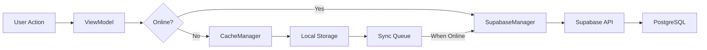

# Design Document - Integração Supabase no Minds Flow

## Overview

Este documento descreve a arquitetura técnica para integrar o Supabase como backend do aplicativo iOS Minds Flow. A integração substituirá os dados mock atuais por persistência real, mantendo compatibilidade com o website existente que já usa o mesmo banco de dados.

### Objetivos

1. Conectar o app iOS ao Supabase existente (projeto: txlukdftqiqbpdxuuozp)
2. Mapear modelos Swift para as 7 tabelas existentes
3. Implementar autenticação real via Supabase Auth
4. Manter sincronização entre iOS app e website
5. Suportar modo offline com sincronização posterior
6. Garantir segurança com Row Level Security (RLS)

### Princípios de Design

- **Compatibilidade**: Usar tabelas existentes sem modificações
- **Segurança**: Implementar RLS e validação de dados
- **Performance**: Cache local e sincronização inteligente
- **Resiliência**: Funcionar offline e sincronizar quando online
- **Manutenibilidade**: Código limpo e bem documentado

## Architecture

### Camadas da Aplicação

```
┌─────────────────────────────────────────┐
│           Views (SwiftUI)               │
│  DashboardView, TasksView, WisdomView   │
└─────────────────┬───────────────────────┘
                  │
┌─────────────────▼───────────────────────┐
│          ViewModels                     │
│  DashboardVM, TasksVM, WisdomVM         │
└─────────────────┬───────────────────────┘
                  │
┌─────────────────▼───────────────────────┐
│          Services Layer                 │
│  SupabaseManager, AuthManager           │
│  SyncManager, CacheManager              │
└─────────────────┬───────────────────────┘
                  │
┌─────────────────▼───────────────────────┐
│       Supabase Swift SDK                │
│  Auth, Database, Realtime               │
└─────────────────┬───────────────────────┘
                  │
┌─────────────────▼───────────────────────┐
│      Supabase Backend                   │
│  PostgreSQL + Auth + Storage            │
└─────────────────────────────────────────┘
```

### Fluxo de Dados



## Components and Interfaces

### 1. SupabaseManager (Refatorado)

Gerenciador central para todas as operações do Supabase.

```swift
@MainActor
class SupabaseManager: ObservableObject {
    // MARK: - Singleton
    static let shared = SupabaseManager()
    
    // MARK: - Properties
    @Published var isOnline: Bool = true
    @Published var currentUser: User?
    
    private let supabase: SupabaseClient
    private let cacheManager: CacheManager
    private let syncManager: SyncManager
    
    // MARK: - Configuration
    private let supabaseURL = "https://txlukdftqiqbpdxuuozp.supabase.co"
    private let supabaseKey = "eyJhbGciOiJIUzI1NiIsInR5cCI6IkpXVCJ9..."
    
    // MARK: - Initialization
    private init() {
        self.supabase = SupabaseClient(
            supabaseURL: URL(string: supabaseURL)!,
            supabaseKey: supabaseKey
        )
        self.cacheManager = CacheManager()
        self.syncManager = SyncManager(supabase: supabase)
        
        setupNetworkMonitoring()
        checkAuthStatus()
    }
    
    // MARK: - Generic CRUD Operations
    func fetch<T: Codable>(
        from table: String,
        matching query: SupabaseQuery? = nil
    ) async throws -> [T]
    
    func insert<T: Codable>(
        _ data: T,
        into table: String
    ) async throws -> T
    
    func update<T: Codable>(
        _ data: T,
        in table: String,
        id: UUID
    ) async throws -> T
    
    func delete(
        from table: String,
        id: UUID
    ) async throws
    
    // MARK: - Realtime Subscriptions
    func subscribe<T: Codable>(
        to table: String,
        onChange: @escaping ([T]) -> Void
    ) -> RealtimeChannel
}
```

### 2. AuthManager (Refatorado)

Gerenciador de autenticação usando Supabase Auth.

```swift
@MainActor
class AuthManager: ObservableObject {
    // MARK: - Singleton
    static let shared = AuthManager()
    
    // MARK: - Properties
    @Published var isAuthenticated = false
    @Published var currentUser: User?
    @Published var userProfile: UserProfile?
    
    private let supabase: SupabaseClient
    
    // MARK: - Authentication Methods
    func signIn(email: String, password: String) async throws
    func signUp(email: String, password: String, name: String) async throws
    func signOut() async throws
    func resetPassword(email: String) async throws
    func updatePassword(newPassword: String) async throws
    
    // MARK: - Profile Management
    func loadUserProfile() async throws -> UserProfile
    func updateUserProfile(_ profile: UserProfile) async throws
    func createUserProfile(for userId: UUID, name: String) async throws
    
    // MARK: - Session Management
    func checkAuthStatus() async
    func refreshSession() async throws
}
```

### 3. CacheManager (Novo)

Gerencia cache local para modo offline.

```swift
class CacheManager {
    // MARK: - Properties
    private let userDefaults = UserDefaults.standard
    private let fileManager = FileManager.default
    
    // MARK: - Cache Operations
    func cache<T: Codable>(_ data: [T], for key: String) throws
    func getCached<T: Codable>(for key: String) throws -> [T]?
    func clearCache(for key: String)
    func clearAllCache()
    
    // MARK: - Cache Keys
    enum CacheKey: String {
        case tasks = "cached_tasks"
        case wisdom = "cached_wisdom"
        case mentalStates = "cached_mental_states"
        case profile = "cached_profile"
    }
}
```

### 4. SyncManager (Novo)

Gerencia sincronização de operações offline.

```swift
class SyncManager {
    // MARK: - Properties
    private let supabase: SupabaseClient
    private var syncQueue: [SyncOperation] = []
    
    // MARK: - Sync Operations
    func queueOperation(_ operation: SyncOperation)
    func syncPendingOperations() async throws
    func clearSyncQueue()
    
    // MARK: - Conflict Resolution
    func resolveConflict<T: Codable>(
        local: T,
        remote: T,
        strategy: ConflictStrategy
    ) -> T
}

struct SyncOperation: Codable {
    let id: UUID
    let type: OperationType
    let table: String
    let data: Data
    let timestamp: Date
    
    enum OperationType: String, Codable {
        case insert, update, delete
    }
}

enum ConflictStrategy {
    case localWins
    case remoteWins
    case mostRecent
    case merge
}
```

## Data Models

### Modelos Atualizados

#### Task (Atualizado)

```swift
struct Task: Codable, Identifiable {
    let id: UUID
    var title: String
    var description: String
    var energyLevel: EnergyLevel
    var purpose: String
    var isCompleted: Bool
    var dueDate: Date?              // NOVO
    var timeEstimate: Int?          // NOVO (em minutos)
    var createdAt: Date
    var updatedAt: Date
    var completedAt: Date?
    let userId: UUID
    
    // MARK: - Supabase Mapping
    enum CodingKeys: String, CodingKey {
        case id
        case title
        case description
        case energyLevel = "energy"
        case purpose
        case isCompleted = "is_completed"
        case dueDate = "due_date"
        case timeEstimate = "time_estimate"
        case createdAt = "created_at"
        case updatedAt = "updated_at"
        case completedAt = "completed_at"
        case userId = "user_id"
    }
}
```

#### Wisdom (Atualizado)

```swift
struct Wisdom: Codable, Identifiable {
    let id: UUID
    var title: String?              // NOVO
    var content: String
    var category: WisdomCategory
    var emotionalTag: Emotion
    var tags: [String]
    var createdAt: Date
    var updatedAt: Date
    let userId: UUID
    
    // MARK: - Supabase Mapping
    enum CodingKeys: String, CodingKey {
        case id
        case title
        case content
        case category
        case emotionalTag = "emotional_tag"
        case tags
        case createdAt = "created_at"
        case updatedAt = "updated_at"
        case userId = "user_id"
    }
}
```

#### UserProfile (Atualizado)

```swift
struct UserProfile: Codable, Identifiable {
    let id: UUID
    var name: String
    var avatarUrl: String?          // NOVO
    var theme: AppTheme
    var language: String?           // NOVO
    var createdAt: Date
    var updatedAt: Date
    
    // REMOVIDO: currentEnergyLevel (agora em MentalState)
    // REMOVIDO: currentEmotion (agora em MentalState)
    // REMOVIDO: isCollapseMode (preferência local)
    
    // MARK: - Supabase Mapping
    enum CodingKeys: String, CodingKey {
        case id
        case name
        case avatarUrl = "avatar_url"
        case theme
        case language
        case createdAt = "created_at"
        case updatedAt = "updated_at"
    }
}
```

#### MentalState (Atualizado para Model completo)

```swift
struct MentalState: Codable, Identifiable {
    let id: UUID
    let userId: UUID
    var mood: Emotion
    var energy: Int                 // 1-10 scale
    var notes: String?
    let createdAt: Date
    
    // MARK: - Computed Properties
    var energyLevel: EnergyLevel {
        switch energy {
        case 1...3: return .low
        case 4...7: return .medium
        case 8...10: return .high
        default: return .medium
        }
    }
    
    // MARK: - Supabase Mapping
    enum CodingKeys: String, CodingKey {
        case id
        case userId = "user_id"
        case mood
        case energy
        case notes
        case createdAt = "created_at"
    }
    
    // MARK: - Conversion Methods
    static func energyToInt(_ level: EnergyLevel) -> Int {
        switch level {
        case .low: return 2
        case .medium: return 5
        case .high: return 9
        }
    }
}
```

### Novos Modelos

#### TimelineEvent (Novo)

```swift
struct TimelineEvent: Codable, Identifiable {
    let id: UUID
    let userId: UUID
    var actionActivityCount: Int?
    var tasksCompleted: Int?
    var mentalStatusCount: Int?
    var timelineEventCount: Int?
    var userSince: Date?
    let createdAt: Date
    let updatedAt: Date
    
    // MARK: - Supabase Mapping
    enum CodingKeys: String, CodingKey {
        case id
        case userId = "user_id"
        case actionActivityCount = "action_activity_count"
        case tasksCompleted = "tasks_completed"
        case mentalStatusCount = "mental_status_count"
        case timelineEventCount = "timeline_event_count"
        case userSince = "user_since"
        case createdAt = "created_at"
        case updatedAt = "updated_at"
    }
}
```

#### UsageStats (Novo)

```swift
struct UsageStats: Codable, Identifiable {
    let id: UUID
    let userId: UUID
    var wisdomEntriesCount: Int?
    var totalTasks: Int?
    var completedTasks: Int?
    var mentalStateEntries: Int?
    var timelineEvents: Int?
    var userSince: Date?
    let createdAt: Date
    let updatedAt: Date
    
    // MARK: - Computed Properties
    var completionRate: Double {
        guard let total = totalTasks, total > 0,
              let completed = completedTasks else { return 0 }
        return Double(completed) / Double(total)
    }
    
    // MARK: - Supabase Mapping
    enum CodingKeys: String, CodingKey {
        case id
        case userId = "user_id"
        case wisdomEntriesCount = "wisdom_entries_count"
        case totalTasks = "total_tasks"
        case completedTasks = "completed_tasks"
        case mentalStateEntries = "mental_state_entries"
        case timelineEvents = "timeline_events"
        case userSince = "user_since"
        case createdAt = "created_at"
        case updatedAt = "updated_at"
    }
}
```

#### Subscription (Novo)

```swift
struct Subscription: Codable, Identifiable {
    let id: UUID
    let userId: UUID
    var planId: String
    var status: SubscriptionStatus
    var currentPeriodStart: Date
    var currentPeriodEnd: Date
    var stripeCustomerId: String?
    var stripeSubscriptionId: String?
    let createdAt: Date
    let updatedAt: Date
    
    // MARK: - Subscription Status
    enum SubscriptionStatus: String, Codable {
        case active
        case inactive
        case cancelled
        case pastDue = "past_due"
    }
    
    // MARK: - Computed Properties
    var isActive: Bool {
        return status == .active && currentPeriodEnd > Date()
    }
    
    // MARK: - Supabase Mapping
    enum CodingKeys: String, CodingKey {
        case id
        case userId = "user_id"
        case planId = "plan_id"
        case status
        case currentPeriodStart = "current_period_start"
        case currentPeriodEnd = "current_period_end"
        case stripeCustomerId = "stripe_customer_id"
        case stripeSubscriptionId = "stripe_subscription_id"
        case createdAt = "created_at"
        case updatedAt = "updated_at"
    }
}
```

## ViewModels Integration

### TasksViewModel (Atualizado)

```swift
@MainActor
class TasksViewModel: ObservableObject {
    @Published var tasks: [Task] = []
    @Published var isLoading = false
    @Published var errorMessage: String?
    
    private let supabase = SupabaseManager.shared
    private let cache = CacheManager()
    private var realtimeChannel: RealtimeChannel?
    
    // MARK: - CRUD Operations
    func loadTasks() async {
        isLoading = true
        defer { isLoading = false }
        
        do {
            // Tentar carregar do Supabase
            let fetchedTasks: [Task] = try await supabase.fetch(
                from: "tasks",
                matching: .userId(supabase.currentUser?.id)
            )
            tasks = fetchedTasks
            
            // Atualizar cache
            try cache.cache(fetchedTasks, for: .tasks)
            
        } catch {
            // Se falhar, carregar do cache
            if let cachedTasks: [Task] = try? cache.getCached(for: .tasks) {
                tasks = cachedTasks
            }
            errorMessage = error.localizedDescription
        }
    }
    
    func createTask(_ task: Task) async {
        do {
            let created: Task = try await supabase.insert(task, into: "tasks")
            tasks.append(created)
            try cache.cache(tasks, for: .tasks)
        } catch {
            // Queue para sincronização posterior
            syncManager.queueOperation(.insert(task, in: "tasks"))
            errorMessage = error.localizedDescription
        }
    }
    
    // MARK: - Realtime Subscription
    func subscribeToChanges() {
        realtimeChannel = supabase.subscribe(to: "tasks") { [weak self] (changes: [Task]) in
            self?.tasks = changes
        }
    }
}
```

### DashboardViewModel (Atualizado)

```swift
@MainActor
class DashboardViewModel: ObservableObject {
    @Published var currentMentalState: MentalState?
    @Published var usageStats: UsageStats?
    @Published var suggestedTasks: [Task] = []
    @Published var suggestedWisdom: [Wisdom] = []
    
    private let supabase = SupabaseManager.shared
    
    // MARK: - Load Current State
    func loadCurrentState() async {
        guard let userId = supabase.currentUser?.id else { return }
        
        do {
            // Carregar estado mental mais recente
            let states: [MentalState] = try await supabase.fetch(
                from: "mental_states",
                matching: .userId(userId).orderBy("created_at", descending: true).limit(1)
            )
            currentMentalState = states.first
            
            // Carregar estatísticas de uso
            let stats: [UsageStats] = try await supabase.fetch(
                from: "usage_stats",
                matching: .userId(userId)
            )
            usageStats = stats.first
            
            // Atualizar sugestões
            updateSuggestions()
            
        } catch {
            print("Error loading dashboard: \\(error)")
        }
    }
    
    // MARK: - Update Mental State
    func updateMentalState(energy: EnergyLevel, emotion: Emotion, notes: String?) async {
        guard let userId = supabase.currentUser?.id else { return }
        
        let newState = MentalState(
            id: UUID(),
            userId: userId,
            mood: emotion,
            energy: MentalState.energyToInt(energy),
            notes: notes,
            createdAt: Date()
        )
        
        do {
            let created: MentalState = try await supabase.insert(newState, into: "mental_states")
            currentMentalState = created
            updateSuggestions()
        } catch {
            print("Error updating mental state: \\(error)")
        }
    }
}
```

## Error Handling

### Error Types

```swift
enum SupabaseError: LocalizedError {
    case notAuthenticated
    case networkError(Error)
    case invalidData
    case notFound
    case permissionDenied
    case offline
    
    var errorDescription: String? {
        switch self {
        case .notAuthenticated:
            return "Você precisa estar autenticado"
        case .networkError(let error):
            return "Erro de rede: \\(error.localizedDescription)"
        case .invalidData:
            return "Dados inválidos"
        case .notFound:
            return "Registro não encontrado"
        case .permissionDenied:
            return "Permissão negada"
        case .offline:
            return "Você está offline. As alterações serão sincronizadas quando voltar online."
        }
    }
}
```

### Error Handling Strategy

1. **Network Errors**: Mostrar mensagem e usar cache
2. **Auth Errors**: Redirecionar para login
3. **Validation Errors**: Mostrar feedback inline
4. **Offline**: Queue operations e sincronizar depois
5. **Conflicts**: Resolver usando estratégia configurada

## Testing Strategy

### Unit Tests

```swift
class SupabaseManagerTests: XCTestCase {
    func testFetchTasks() async throws
    func testCreateTask() async throws
    func testUpdateTask() async throws
    func testDeleteTask() async throws
    func testOfflineMode() async throws
    func testSyncAfterOnline() async throws
}

class AuthManagerTests: XCTestCase {
    func testSignIn() async throws
    func testSignUp() async throws
    func testSignOut() async throws
    func testProfileCreation() async throws
}

class CacheManagerTests: XCTestCase {
    func testCacheData() throws
    func testRetrieveCache() throws
    func testClearCache() throws
}
```

### Integration Tests

```swift
class SupabaseIntegrationTests: XCTestCase {
    func testEndToEndTaskFlow() async throws
    func testEndToEndWisdomFlow() async throws
    func testMentalStateTracking() async throws
    func testOfflineSync() async throws
}
```

### Manual Testing Checklist

- [ ] Login com credenciais válidas
- [ ] Criar, editar e deletar tarefas
- [ ] Criar, editar e deletar wisdom
- [ ] Atualizar estado mental
- [ ] Verificar sincronização entre devices
- [ ] Testar modo offline
- [ ] Verificar sincronização após voltar online
- [ ] Testar com dados do website
- [ ] Verificar RLS (tentar acessar dados de outro usuário)

## Security Considerations

### Row Level Security (RLS)

Políticas RLS já devem estar configuradas no Supabase:

```sql
-- Exemplo de política para tasks
CREATE POLICY "Users can only see their own tasks"
ON tasks FOR SELECT
USING (auth.uid() = user_id);

CREATE POLICY "Users can only insert their own tasks"
ON tasks FOR INSERT
WITH CHECK (auth.uid() = user_id);

CREATE POLICY "Users can only update their own tasks"
ON tasks FOR UPDATE
USING (auth.uid() = user_id);

CREATE POLICY "Users can only delete their own tasks"
ON tasks FOR DELETE
USING (auth.uid() = user_id);
```

### Data Validation

```swift
extension Task {
    func validate() throws {
        guard !title.isEmpty else {
            throw ValidationError.emptyTitle
        }
        guard title.count <= 200 else {
            throw ValidationError.titleTooLong
        }
        if let estimate = timeEstimate {
            guard estimate > 0 && estimate <= 1440 else {
                throw ValidationError.invalidTimeEstimate
            }
        }
    }
}
```

### Secure Storage

- Usar Keychain para tokens de autenticação
- Não armazenar credenciais em UserDefaults
- Criptografar cache local sensível

## Performance Optimization

### Caching Strategy

1. **Memory Cache**: Para dados frequentemente acessados
2. **Disk Cache**: Para dados offline
3. **Cache Invalidation**: Após 5 minutos ou quando dados mudam

### Pagination

```swift
func loadTasks(page: Int, pageSize: Int = 20) async throws -> [Task] {
    return try await supabase.fetch(
        from: "tasks",
        matching: .userId(userId)
            .orderBy("created_at", descending: true)
            .range(from: page * pageSize, to: (page + 1) * pageSize - 1)
    )
}
```

### Realtime Optimization

- Subscrever apenas às tabelas necessárias
- Unsubscribe quando view desaparece
- Debounce updates para evitar UI flicker

## Migration Plan

### Phase 1: Setup (1-2 dias)
1. Configurar credenciais do Supabase
2. Atualizar SupabaseManager
3. Atualizar AuthManager
4. Criar CacheManager e SyncManager

### Phase 2: Models (1 dia)
1. Atualizar Task, Wisdom, UserProfile
2. Criar TimelineEvent, UsageStats, Subscription
3. Adicionar CodingKeys para mapeamento
4. Implementar conversões de energia

### Phase 3: ViewModels (2-3 dias)
1. Refatorar TasksViewModel
2. Refatorar WisdomViewModel
3. Refatorar DashboardViewModel
4. Adicionar tratamento de erros

### Phase 4: Testing (2 dias)
1. Testes unitários
2. Testes de integração
3. Testes manuais
4. Validação com website

### Phase 5: Polish (1 dia)
1. Melhorar mensagens de erro
2. Adicionar loading states
3. Otimizar performance
4. Documentação final

**Total estimado: 7-9 dias**
